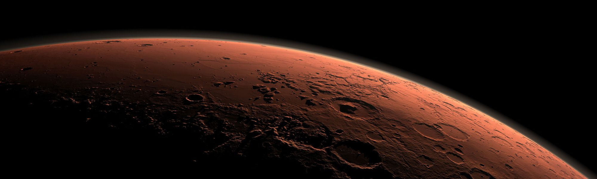

# The Mars Craters Study  

The dataset presents a global database that includes over 300,000 Mars craters 1 km or larger that were created between 4.2 and 3.8 billion years ago during a period of heavy bombardment (i.e. impacts of asteroids, proto-planets, and comets).  

### Variables

* **CRATER_ID** – crater ID for internal sue, based upon the region of the planet (1/16ths), the “pass” under which the crate was identified, ad the order in which it was identified  
* **LATITUDE_CIRCLE_IMAGE** – latitude from the derived center of a non-linear least-squares circle fit to the vertices selected to manually identify the crater rim (units are decimal degrees North)
* **LONGITUDE_CIRCLE_IMAGE** – longitude from the derived center of a non-linear least-squares circle fit to the vertices selected to manually identify the crater rim (units are decimal degrees East)
* **DIAM_CIRCLE_IMAGE** – diameter from a non-linear least squares circle fit to the vertices selected to manually identify the crater rim (units are km)
* **DEPTH_RIMFLOOR_TOPOG** – average elevation of each of the manually determined N points along (or inside) the crater rim(units are km)
    - Depth Rim - Points are selected as relative topographic highs under the assumption they are the least eroded so most original points along the rim 
    - Depth Floor – Points were chosen as the lowest elevation that did not include visible embedded craters
* **MORPHOLOGY_EJECTA_1** – ejecta morphology classified. If there are multiple values, separated by a “/”, then the order is the inner-most ejecta through the outer-most, or the top-most through the bottom-most
* **MORPHOLOGY_EJECTA_2** – the morphology of the layer(s) itself/themselves. This classification system is unique to this work.
* **MORPHOLOGY_EJECTA_3** – overall texture and/pr shape of some of the layer(s)/ejecta that are generally unique and deserve separate morphological classification. 
* **NUMBER_LAYERS** – the maximum number of cohesive layers in any azimuthal direction that could be reliably identified

### Topic of interest

I would like to check whether the number and size of Martian craters correlates with their location - in particular with latitude. I assume that the planet's axis of rotation should form a relationship with the level of intensity of its surface bombardment with meteorites.

### Hypothesis

The largest accumulations of craters and their largest sizes will be observed in the equatorial zone. There should be a negative correlation between the crater diameter *diam* and *latitude*.

It would also be worth to supplement the set with additional variables that would define the density of craters. On the basis of geographical coordinates (*latitude*, *longitude*) I will calculate the *distance from* the nearest craters or the *number of* craters within a radius of n km (where n may be a few different parameters).
